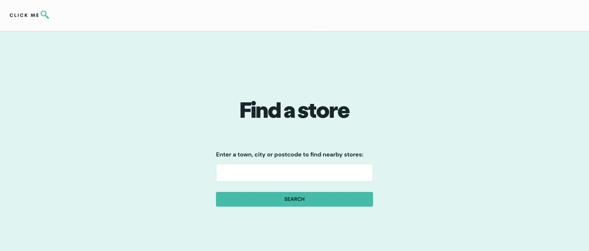

# Store finder web app
A Flask API to return store location data (city/town name and postcode).

The frontend is Vue.js web app (see ```store-finder/client```).



## Dependencies
- Python 3.9
- Pip
- Pipenv
- Flask
- Flask-cors

## Setup
In your terminal:

    $ cd store-finder/api

Make sure you have Python 3.x and Pipenv installed:

    $ python --version
    $ pipenv
Then run the following commands in a terminal window to start your virtual environment, install required dependencies and run the API:

    $ pipenv shell
    $ pipenv install 
    $ FLASK_ENV=development pipenv run flask run # Start development server
    (env)$ python3 app.py
   Test the endpoints at http://127.0.0.1:5000/ either in your browser or using [Postman](https://www.postman.com/).
   
   To stop `appy.py`, use `ctrl + c`. 
   To exit the virtual environment, use `ctrl + d`.
