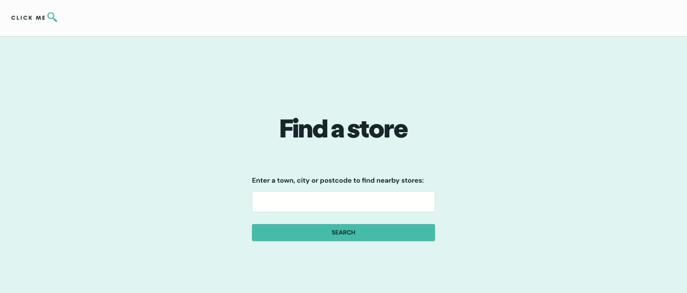

# Store finder web app
A web app for customers to search for store lcoations based on 
inputted town, city or postcode. 

The data is provided by a Flask API in ```store-finder/api```.



## Dependencies
- Vue 3
- Axios
- Lodash

## Project setup
```
$ cd store-finder/client
$ npm install
```

### Compiles and hot-reloads for development
```
npm run serve
```

### Compiles and minifies for production
```
npm run build
```

### Lints and fixes files
```
npm run lint
```
